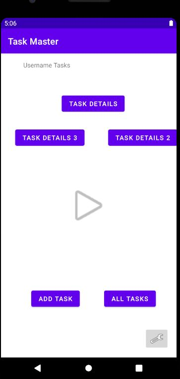
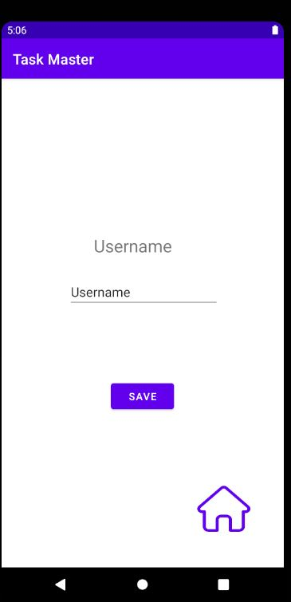
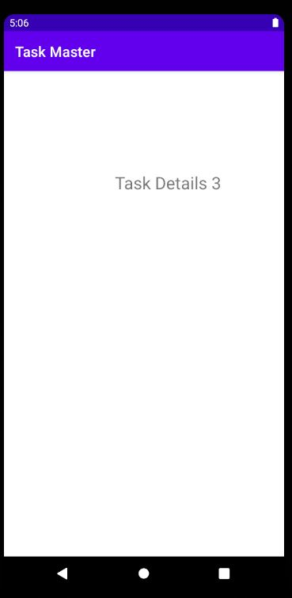

# Taskmaster

An android application that helps users to manage their tasks and edit them. Java were used to create this app using android studio.

Home Page:

Settings Page:

Add Task Page:

Task Details Page:

Daily change log:

8th of August, 2021: Added home page with two buttons, each navigate to new page, one of them task details that navigates to page that simply prints out "Task Details", and the other one is add task button which navigates to new activity that has form to add new tasks and button to save them, when save button is pressed a new Toast shows up to confirm saving.

9th of August, 2021: Added new Settings image button, which navigates the user to new activity to add his username and save it, then render it inside home page as title. Also, two task details buttons were added each one renders its text value in new page.

11th of Augus, 2021: Added RecyclerView to home page, with functionality to add task by pressing "Add Task" button and it will appear in the list in the home page.

